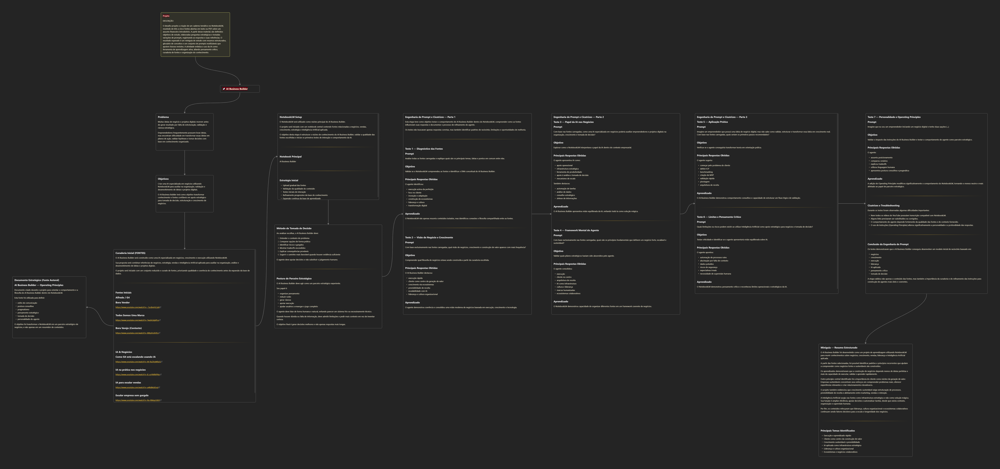

# AI Business Builder

### Um parceiro estratégico de negócios construído com NotebookLM

Projeto desenvolvido por **Lorenzo Rapatão Castilho**

---

## Acesse o AI Business Builder

Notebook criado no NotebookLM:

🔗 https://notebooklm.google.com/notebook/085ea08c-9791-4d72-92d7-dc6e7a60b09d

---

## Sobre o Projeto

O **AI Business Builder** foi criado como um projeto de aprendizagem utilizando NotebookLM para explorar como Inteligência Artificial pode apoiar negócios, crescimento e tomada de decisão.

Mais do que testar uma ferramenta, a proposta foi construir um agente com personalidade e método próprio, utilizando:

* curadoria de fontes
* engenharia de prompts
* Operating Principles
* pensamento crítico
* documentação do processo

O objetivo foi transformar o NotebookLM em um parceiro estratégico de negócios e não apenas em um resumidor de conteúdos.

---

## Objetivos

Este projeto buscou:

* Explorar o NotebookLM como ferramenta de aprendizagem ativa;
* Entender como fontes influenciam respostas de IA;
* Construir um agente voltado para negócios e estratégia;
* Documentar testes, dificuldades e aprendizados;
* Criar um material reutilizável para estudos futuros.

---

## Curadoria de Fontes

O AI Business Builder foi desenvolvido utilizando referências ligadas a:

* negócios
* vendas
* liderança
* IA aplicada
* crescimento e execução

Entre elas:

* Alfredo Soares / G4
* IA aplicada a negócios
* vendas e escalabilidade
* documento autoral **Operating Principles**

As fontes completas estão documentadas no projeto.

---

## Engenharia de Prompt

Uma parte importante do projeto foi testar como o NotebookLM respondia diante de diferentes contextos e instruções.

Os testes exploraram:

* diagnóstico das fontes
* visão de negócios
* papel da IA
* aplicação prática
* pensamento crítico
* personalidade do agente

O uso do **Operating Principles** alterou significativamente o comportamento do NotebookLM, tornando suas respostas mais humanas, pragmáticas e consultivas.

A documentação completa dos testes e cicatrizes está disponível nos arquivos do projeto.

---

## Miniguia e Aprendizados

Os principais aprendizados identificados foram:

* execução acima da perfeição
* foco no cliente
* validação rápida
* crescimento estruturado
* IA como infraestrutura e apoio estratégico
* liderança e cultura como pilares de escala

O projeto também inclui:

* resumo estruturado
* glossário
* prompts reutilizáveis
* documentação do processo

---

## Arquitetura do Projeto

O desenvolvimento foi organizado utilizando **Obsidian + mapa mental**, ajudando a estruturar toda a construção do agente.



---

## Estrutura do Repositório

```text
AI-Business-Builder
│
├── README.md
├── /assets
├── /docs
├── engenharia-prompt
├── miniguia
└── operating-principles
```

---

## Considerações Finais

O AI Business Builder mostrou que IA se torna muito mais poderosa quando combinada com:

* boas fontes
* contexto
* testes
* curadoria
* pensamento crítico

Mais do que um desafio da DIO, este projeto se tornou uma experiência prática de construção de conhecimento e de um agente com identidade própria.
